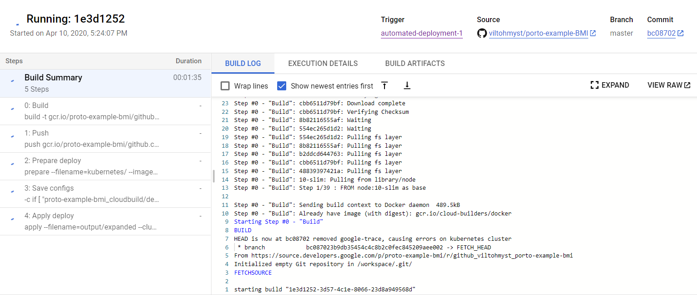

# Introduction

This is node.js project which shows the integration of several frameworks together to create a complete node.js app. It also showcases the use of Typescript language features as well as the use of different programming paradigms.

This app uses no frameworks and has zero production dependencies except the reflection-metadata polyfill. You can use this repo as a starting template for your own project which uses Typescript + Jest + Supertest + VSCode IDE.

## How to Use the Service Endpoint

**Short summary for local environment:**

Run **npm run build** and then **npm run start**, send a http request to localhost with the following signature (for example) :
```
localhost:3000/?height=170&weight=70
```
You should get a JSON response like below :
```json
{
    "bmi": 24.22,
    "label": "normal"
}
```

**Accessing my deployed endpoint**

I am providing a http address for which you can test the http endpoint. As you can read on, it is deployed on google cloud with GKE (Google Kubernetes Engine). The deployed endpoint is not accessed with port 3000 but rather port 80 (uses port mapping at the exposed service).

```
http://35.240.171.244:80/?height=170&weight=71
```
I will not be providing the http endpoint indefinetely though, and may go down without further notice.

## Features

-   Input validation mini-framework (used in this app to validate param query inputs).
    -   Implemented using Typescript classes, interface, and callback type signatures.
-   Web mini-framework which provides HTTP request routing using decorators.
    -   Implemented using Javascript reflection-metadata API.
-   Integration with various development tools listed below (setup config files and package.json scripts).
-   Documented code with the JSDoc standard.

## Tools Used

-   Typescript (Javascript)
-   Visual Studio Code
    -   The debugger configuration (launch.json) is setup so you can debug both the app and the test files.
-   Unit Testing with "Jest" framework
-   Endpoint Testing with "Supertest"
-   Docker
    -   Multistage Build Dockerfile (including production, development and testing images)
    -   Development and Test server hot-reloading
    -   Uses the aquasec microscanner to scan for image vulnerabilites during building the image. See the following link to read more about aquasec: [Aquasec Microscanner](https://github.com/aquasecurity/microscanner)
-   Kubernetes
    -   Kubernetes deployment file (used in the Google Kubernetes Engine)

## Versions

This repo demonstrates two versions of the same running application. The first version (v1.1.1) has **Zero Production Dependencies** whereas the next version (v1.2.0) has a production dependency for the _Reflection Metadata_ package. The _Reflection Metadata_ package is used as a polyfill for the experimental proposed Javascript reflection API.

## Running the App

If you have node.js (thus npm) installed on your local machine, then simply run :

```shell
npm run build
npm start
```

The commands above will build the output bundle and start the server from the build output.

If you want to initiate a unit-test run, simply type in the following command :

```shell
npm run test
# or if you want to continuously watch for changes and re-run
npm run test:watch
```

If you want to run the development server with hot-reloading (will restart the server on file changes), use the dev command :

```shell
npm run dev
```

Refer to the file "package.json" for what commands are invoked on the command line when the scripts are executed.

In the case you do not have npm installed but have docker available on your machine, refer to the section below on using the docker script commands.

## Building the Docker Image (Optional)

There are two ways with which you can run (and develop) this app, which is with and without docker. Several NPM scripts have been provided for convenience when working with docker (instead of trying to remember long CLI lines).

**Build the Docker Image**

If you do not have a node development environment or just simply do not want to run any npm commands on your host machine, you can run this app locally using docker (provided that docker is installed on your machine)

The docker image is built using a **multistage** build dockerfile. There are six stages which is base, dev, test, scan, pre-prod and production.

Before building the docker image, get your own microscanner token at [Microscanner Signup](https://microscanner.aquasec.com/signup) and export it as an environment variable with the name MICROSCANNER_TOKEN. If you do not have a MICROSCANNER_TOKEN setup in your environment variable, the build will skip the scan step and output the microscanner command (but should continue building without problems).

The dockerized version of the npm scripts have a ":docker" postfix, so instead of npm run start, you would run npm run start:docker.

To start the build process, run the following command :

```shell
npm run build:docker
```

This will build all the stages in the multistage dockerfile. To start the server, run npm start:docker from the command line.

```shell
npm run start:docker
```

**Start the development server (with hot-reload)**

To start the development server with hot-reload, run the following command :

```shell
npm run dev:docker
```

The npm run dev:docker command provides convenience in that it uses docker bind-mounts to synchronize your host filesystem with that of the container's. What this means is that the nodemon process in the container will watch for file changes on your host system (where you develop, change and save files) and will automatically rebuild it using the installed npm dependencies and dev-dependencies installed on the docker container (unless you have your own node_modules folder on your host machine).

**Run the test runner and watch for file changes (like hot-reload**)

If you want to run your unit tests and continuously monitor (watch for any changed files - dimilar to dev above), run the following command:

```shell
npm run test:docker
```

This will initiate "jest --watchAll" which will rerun the test runner on every change of \*.spec.ts files.

# Typescript (Javascript) Programming Language Features

This app shows the application of several different programming paradigm and language features.

## Object Oriented Programming (OOP)

Check the files _"/src/util/validationRule.ts"_ and _"/src/util/urlValidator.ts"_ to see examples of using Typescripts language features for OOP.

The Rule validator class was designed to "validate the value and existence" of an item within a collection (referenced by a key or index). This collection could be an object, a Map, an array and so forth.

If I had a collection of url query parameters, I could use this class to check the url contents for the existence and value of a certain query parameter. To use the class you would have to implement the _"AccessorCallback"_ type with a callback that satisfies the type signature. The AccessorCallback should return a value (or null if it doesn't exist) given the input "key" to a collection. The example below shows how this "Rule" class is used by the "URLValidator" class to validate its url:

```typescript
class URLValidator {
private queryRuleArray: Rule[] = [];
//...
    public checkURLValidity = (urlToCheck: URL): RuleResult => {
    //...
        //Concrete implementation of the Accessor Callback
        const checkURLQuery: AccessorCallback = (query: string): any => {
			const result = urlToCheck.searchParams.get(query);
			return result;
		};

        //The value of the "key" (query name) will be provided by the Rule itself. The instance of Rule will run the checkURLQuery with this "key" it has stored when it was constructed.
		this.queryRuleArray.forEach((value) => {
			const result = value.checkRule(checkURLQuery);
			if (result.passed === false) {
				returnResult.passed = false;
				returnResult.errorMessage += `${result.errorMessage}\r\n`;
			}
        });
        //...
}
```

The example above shows how Typescript can be used to define an interface

## Aspect Oriented Programming

The routing functionality has been implemented with a @route decorator. This decorator serves as a "point-cut" in aspect oriented programming. Such us of the paradigm in routing functionality is common practice in javascript, so I implemented a simple version in this app.

By using decorators we can avoid nested "If" statements for routing functionality, compare how routing is done in the v1.1.x tags compared to the v1.2.x tags in this repo. To declare a route, simply create a class which inherits from the **MiniWebFramework** class defined in *"/src/util/miniWebFramework.ts"* like so :

```typescript
class Controller extends MiniWebFramework {

    // define a http endpoint path
    @route("/somepath")
    someCallback(request, response){
        // do some stuff with request
        //...
        
        // write a response
        response.write("a response");
        response.end()
    }

    // define another http endpoint path
    @route("/anotherpath")
    anotherCallback(request, response){
        // do some other stuff
    }
}
```

## Functional Programming

All the logic related to Body Mass Index calculation and classification was purposefully done in a Functional Programming perspective (albeit a simple example). Refer to the files _"/src/bmi-calculator/bmiCalculator.ts"_ and _"/src/bmi-calculator/bmiCalculator.ts"_ and you will see that they implement **Pure Functions** which :

-   Given the same inputs, always returns the same output, and
-   Has no side-effects

The whole process of getting input from the HTTP request and sending a response is achieved through **Function Composition** and avoids any shared state (see the diagram below). The weight thresholds are also not hard-coded but are stored as enums (which can be changed later on if you want to).

```
                                weightThresholdEnum
                                        |
                                        v
httpRequest --> bmiCalculator --> bmiClassifier --> httpResponse
```

## Method Chaining

The **Rule** class in _"/src/util/validationRule.ts"_ implements _method chaining_ which is a declarative way to express the program logic. So instead of having to write nested if calls like this :

```javascript
let result = false;
if (value !== null) {
	if (typeof value === "number") {
		if (query > 30 && query < 50) {
			result = true;
		}
	}
}
```

You can declaratively express the value requirements like so :

```javascript
const validator = new Rule("number", "formInput");
const result = validator.isFloat().isgreaterThan(30).islessThan(50);
validator.checkRule(value);
console.log(result);
// result will contain whether the rules have passed or not and an error message of which rules did not pass (if any).
```

# CI/CD Pipeline

If you inspect the Dockerfile, you can see that within the multistage builds, it already performs linting, testing and vulnerability scanning as part of the container build process. This way you can ensure that the build image has passed code quality checks, unit testing (and any other testing) and vulnerability tests no matter whats next on the CI pipeline.

For example, I connected the this github repo with two container registries through webhooks, these registries are dockerhub and google cloud container registry. Because I've done my testing in the dockerfile, I don't have to setup any more testing pipelines on dockerhub or google cloud separately. You could do additional processes after a successful push such as using github actions or using tools from github's integrated marketplace though.

For each **git push** I do to the master branch, two things happen :

-   **dockerhub** starts building a new image with the **latest** tag or a version tag if I do a **git push --tag"**. Check out this image's public container repo at : [dockerhub repo](https://hub.docker.com/repository/docker/viltohmyst/proto-example-bmi)
-   google **Cloud Build** will start to build the new image and store it in my private google **Cloud Container Registry**. It will tag each build with a different version number and start a new deployment to the workload in the running GKE (Google Kubernetes Engine) cluster. Check the deployment YAML configuration in _"/kubernetes/bmi-deployment.yaml"_.

The diagram below shows the general CI/CD pipeline I've setup for this repo (maybe someday I'll write a blog article on how to setup a similar pipeline step by step).


# Google Kubernetes Engine

In google cloud, the app is served through a Kubernetes cluster with a workload which has an exposed service to the internet. Any new pushes to the github master branch will kickoff the build process in google cloud and the new images will automaticly be rolled out to replace the old pods with the old images. Refer to the kubernetes deployment yaml files' section on update strategy :

```yaml
strategy:
    rollingUpdate:
        maxSurge: 25%
        maxUnavailable: 25%
    type: RollingUpdate
```

# GCP Monitoring and Logging

Google Kubernetes Engine (GKE) is already integrated with the Google Monitoring and Logging service. As long as your app outputs its logs to stdout or stderr, you can observe those log outputs automatically on the google cloud platform without any additional setting or library API in your codebase, hooray!

You can view the status of your build process, and if anything fails, at which step it failed.



The above picture shows an automated build running after a previous update on the github master branch.

**Logging**

You can view the logs of any of the resources deployed as part of your deployment. See the picture below for an example list of resources you can view from the google cloud logging interface. Notice you can view logs at the cluster, node, pod and container levels in your Kubernetes cluster.


Because the GKE cluster is load balanced, you cant just check one running container to see the log response from an API request you sent to the GKE service's IP endpoint. Thus to see an aggregated response of all containers through a service, you can view the log of the service instead. See the picture below showing that the app returns a stdout of "OK" each time it handled a request successfully. Each of the "OK" messages in the picture could be from different containers.


**Monitoring**

You can view the resource utilization of your running VM instances (the nodes for your GKE cluster) directly from the **cloud monitoring** dashboard.


Furthermore, google has provided a GKE specific dashboard to see everything related to the performance of your cluster, be that at the infrastructure, workload or services level. The picture below shows the CPU and Memory (as well as health) of each of the compute instances running in the cluster.


For more information on how to monitor a GKE cluster, visit the following link:
https://cloud.google.com/monitoring/kubernetes-engine/observing
